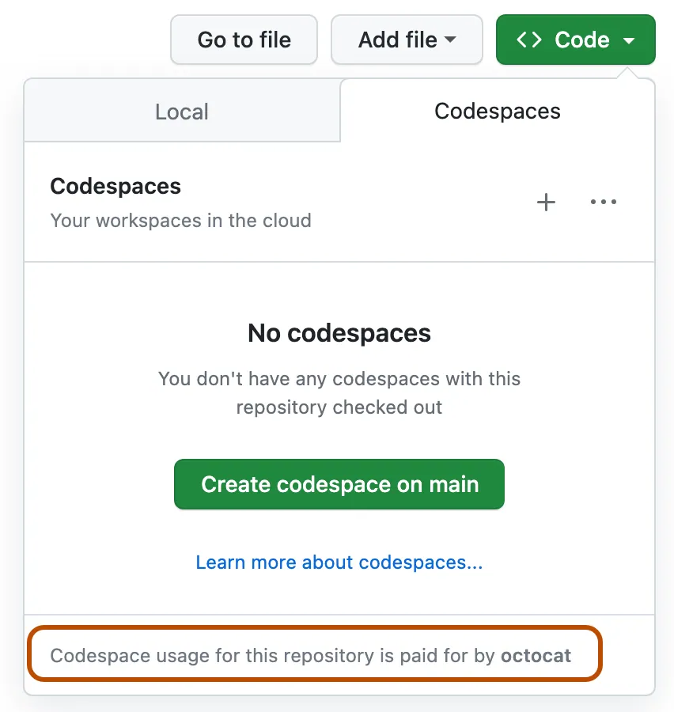

# [OpenHack] Bezpieczne tworzenie aplikacji GenAI by Protopia

Całość zadań będzie realizowana w opaerciu o Github Codespaces oraz narzędzia Azure. W calu przygotowania środowiska pracy wykonaj następujące kroki:

# 1. Fork repozytrium

Wykonaj [forka](https://github.com/microsoft/generative-ai-for-beginners/fork?WT.mc_id=academic-105485-koreyst) tego repozytrium na swoim koncie Github.

# 2. Urochomienie Codespaces

Aby uniknąć problemów z narzędziami podczas uruchamiania kodu, zalecamy uruchomienie zadań w GitHub Codespaces.

Można to zrobić, wybierając opcję Code w w utworzonym w poprzednim kroku repozytorium i wybierając opcję Codespaces."



# 3. Logowanie do Azure

Po uruchomieniu Codespaces w dolnym oknie Terminal wykonaj następujące polecenie Azure CLI[^1]:

```bash
az login --use-device-code
```

W oknie przeglądarki wejdź na następujący adres [https://microsoft.com/devicelogin](https://microsoft.com/devicelogin), wklej wygenerowany w Terminalu kod i zaloguj się używając loginu oraz hasła podanego przez prowadzących.
Nie zamykaj okna Terminalu i przejdź do następnego kroku.

# 4. Stwórz instancje usługi Azure OpenAI

Sprawdź nazwę grupy zasobów, na której będziesz wykonywać wdrożenie:

```bash
az group list
```

Nazwę grupy zasobów znajdziesz w polu "name" w wyświetlonym JSON. Wykonaj następujące kroki w Terminalu:

```bash
RESOURCE_GROUP='twoja-grupa-zasobów'
LOCATION='francecentral'

az cognitiveservices account create \
  --name "$RESOURCE_GROUP"-oai \
  --resource-group $RESOURCE_GROUP \
  --custom-domain "$RESOURCE_GROUP"-oai \
  --location $LOCATION \
  --kind OpenAI \
  --sku 'S0'
```

Zachowaj dla siebie informacje na temat endpointa i klucza do Twojej instancji Azure OpenAI

```bash
az cognitiveservices account show \
    --name "$RESOURCE_GROUP"-oai \
    --resource-group  $RESOURCE_GROUP \
    | jq -r .properties.endpoint

az cognitiveservices account keys list \
    --name "$RESOURCE_GROUP"-oai \
    --resource-group  $RESOURCE_GROUP \
    | jq -r .key1
```

> [!TIP]
> Poprawne przechowywanie kluczy do API jest niezwykle istotne z punktu widzenia bezpieczeństwa Twojego rozwiązania. W związku z tym, że będziesz pracował(a) na publicznym repozytorium, nigdy nie zapisuj w kodzie kluczy ani haseł.

# 5. Stworz konto Azure Storgae

```bash
# Generate a random storage account name (must be unique, lowercase, 24 characters or less)
STORAGE_ACCOUNT_NAME=$(echo "stg$(date +%s | sha256sum | base64 | tr -dc 'a-z0-9' | head -c 15)")

# Create the storage account in the default location of the resource group
az storage account create \
    --name $STORAGE_ACCOUNT_NAME \
    --resource-group $RESOURCE_GROUP \
    --sku Standard_LRS \
    --kind StorageV2

# Create containers using Azure AD authentication
az storage container create \
    --name data-in \
    --account-name $STORAGE_ACCOUNT_NAME \
    --auth-mode login

az storage container create \
    --name data-processed \
    --account-name $STORAGE_ACCOUNT_NAME \
    --auth-mode login
```

# 6. Stwórz instancję usługi Azure AI Search

Stwórz instancję Azure AI Search w oparciu o poniższy skrypt.

```bash
az search service create \
    --name "$RESOURCE_GROUP"-ais \
    --resource-group  $RESOURCE_GROUP \
    --sku basic \
    --aad-auth-failure-mode http401WithBearerChallenge \
    --auth-options aadOrApiKey \
    --identity-type SystemAssigned \
    --partition-count 1 \
    --public-access enabled \
    --replica-count 1 \
    --semantic-search standard
```

Zachowaj klucz do Twojej instancji Azure AI Search

```bash
az search admin-key show \
    --service-name "$RESOURCE_GROUP"-ais \
    --resource-group  $RESOURCE_GROUP \
    | jq -r .primaryKey
```

[^1]: [Dokumentacja Azure CLI](https://learn.microsoft.com/en-us/cli/azure/)
